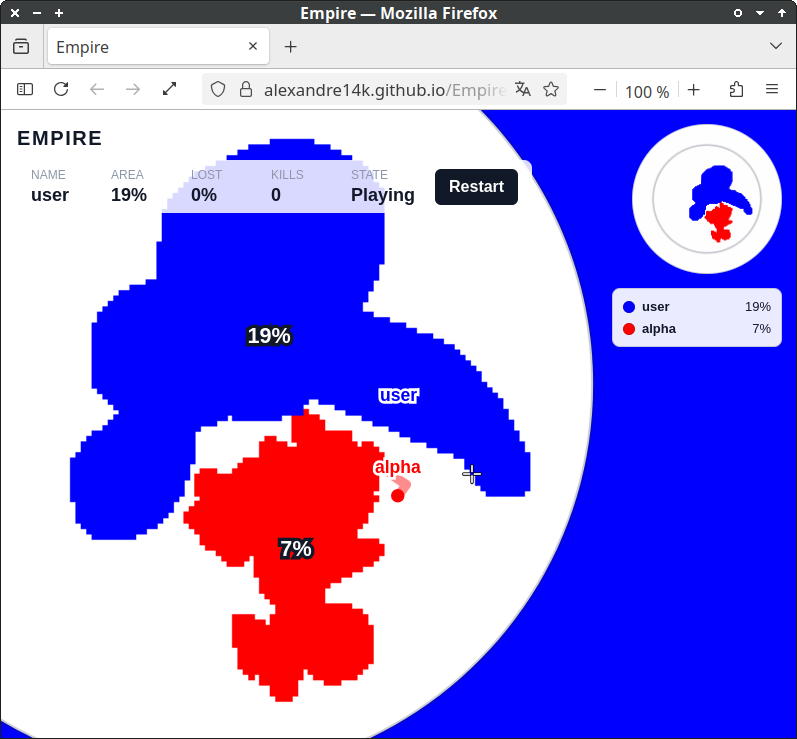

# Empire
Standalone offline javascript like Paper.io game with MVC architecture.

## Hosted on GitHub Pages
You can try it out here:  
<a href="https://alexandre14k.github.io/Empire/" target="_blank" rel="noopener noreferrer">https://alexandre14k.github.io/Empire/</a>

  

## Feedback
- pending future improvements
  - movement lagging
  - unfilled areas
  - self tail crossing

## License

SPDX-License-Identifier: AGPL-3.0-or-later 
Copyright (C) 2026 Alexandre Raduly <alexander14k28@gmail.com>
